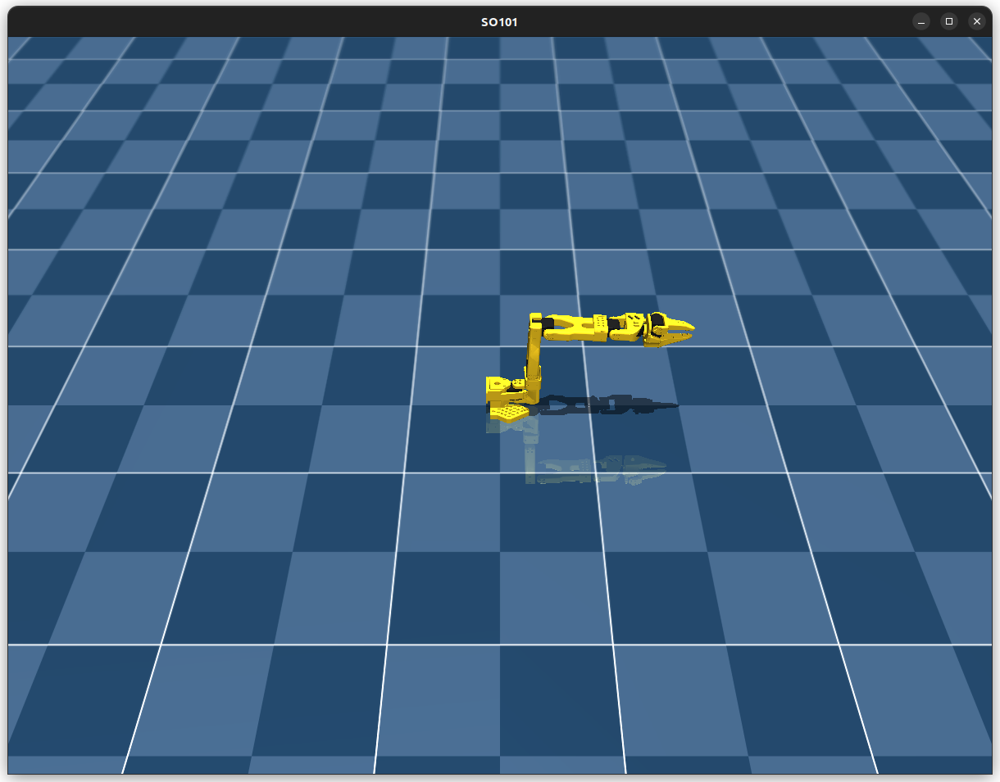
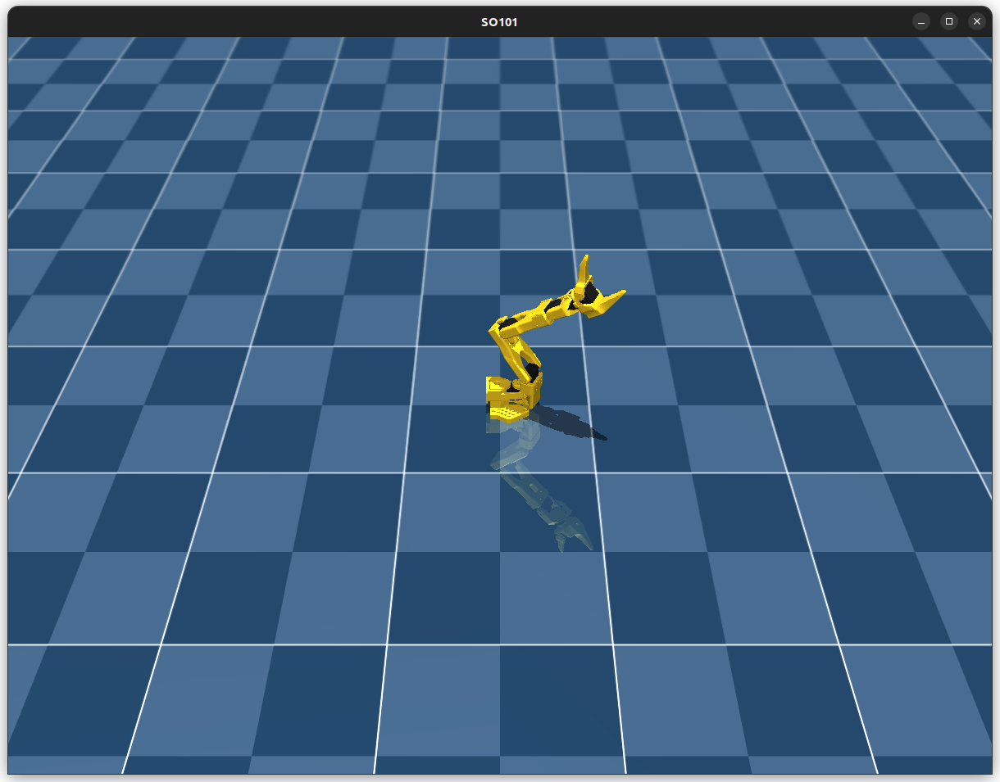

# mujoco_ros2_bridge

This package bridges MuJoCo simulation with ROS2. It provides a C++ interface to MuJoCo and exposes ROS2 nodes for simulation control and data exchange.


## Dependencies
- Ubuntu 22.04 (Tested)
- MuJoCo 3.3.5 (Installed at `/opt/mujoco`; Tested)
- GLFW (Tested)
- ROS2 humble (Tested)

## Build

```bash
cd ~/workspace/ros2_ws
colcon build --packages-select mujoco_ros2_bridge
. install/setup.bash
```

## Usage
### auto control testing
```bash
# test with default model (SO101)
ros2 run mujoco_ros2_bridge test_ctrl
# test with specificated model
ros2 run mujoco_ros2_bridge test_ctrl <path_to_model.xml>
```
### start mujoco-ros2 bridge
Start bridge with
```bash
ros2 launch mujoco_ros2_bridge start_bridge.py
```
Here's the result:

```bash
congying@ubuntu:~$ ros2 launch mujoco_ros2_bridge start_bridge.py
[INFO] [launch]: All log files can be found below /home/congying/.ros/log/2025-08-15-11-43-57-237203-ubuntu-1170371
[INFO] [launch]: Default logging verbosity is set to INFO
[INFO] [mujoco_node-1]: process started with pid [1170378]
[mujoco_node-1] Model with 6 joints has been loaded: 
[mujoco_node-1] [INFO] Setting zero position...
[mujoco_node-1] [INFO] [1755229438.395368922] [mujoco_node]: MuJoCo node started with model file: /home/congying/workspace/ros2_ws/install/mujoco_ros2_bridge/share/mujoco_ros2_bridge/models/SO101/scene.xml
```


Check ros2 topics
```bash
congying@ubuntu:~$ ros2 topic list
/joint_commands
/joint_state
/parameter_events
/rosout
```
Check joint_commands (which is used to control joints)
```bash
congying@ubuntu:~$ ros2 topic info /joint_commands
Type: std_msgs/msg/Float64MultiArray
Publisher count: 0
Subscription count: 1
```
Check joint_state (which is used to publish joints' states)
```bash
congying@ubuntu:~$ ros2 topic info /joint_state
Type: sensor_msgs/msg/JointState
Publisher count: 1
Subscription count: 0
```
Use terminal command to communicate with the robot in MuJoCo
1. subscribe to get joint state of the robot
```bash
congying@ubuntu:~$ ros2 topic echo /joint_state
header:
  stamp:
    sec: 1755239031
    nanosec: 448338864
  frame_id: ''
name:
- ''
- ''
- ''
- ''
- ''
- ''
position:
- 1.881350823220973e-08
- 0.031633230308543564
- 0.02619861206534797
- 0.006291135796022529
- 1.6298053072920067e-06
- -0.00015286701970633376
velocity:
- -8.288977978943893e-09
- -0.00029618339202492554
- -0.00041462184281325126
- 0.00018070196524334447
- 3.1295995675869616e-07
- -2.9316257842423768e-05
effort:
- -3.351755341493836e-07
- -0.5630820436208315
- -0.46635005530079804
- -0.11197578417923836
- -2.8999393095337112e-05
- 0.0027199892919935508
---

```
2. send message to position-control the robot joint
```bash
congying@ubuntu:~$ ros2 topic pub /joint_commands std_msgs/msg/Float64MultiArray '{data: [0.5, -0.7, 0.0, 0.0, 0.0, 1.0]}'
publisher: beginning loop
publishing #1: std_msgs.msg.Float64MultiArray(layout=std_msgs.msg.MultiArrayLayout(dim=[], data_offset=0), data=[0.5, -0.7, 0.0, 0.0, 0.0, 1.0])
publishing #2: std_msgs.msg.Float64MultiArray(layout=std_msgs.msg.MultiArrayLayout(dim=[], data_offset=0), data=[0.5, -0.7, 0.0, 0.0, 0.0, 1.0])
```
Which leades to:



## Models
MuJoCo models are installed to the package share directory.
